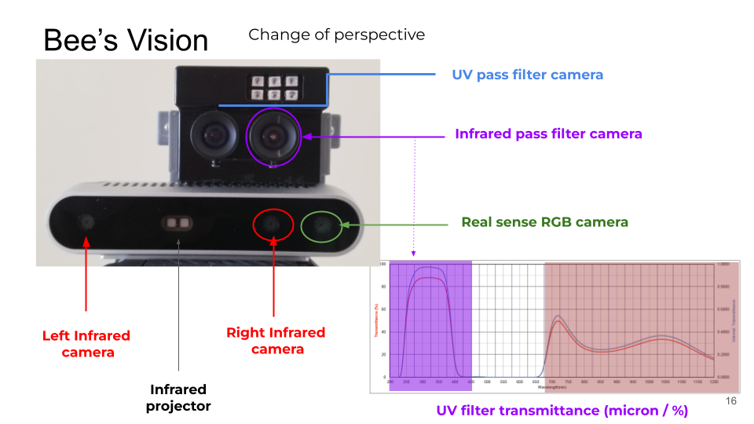
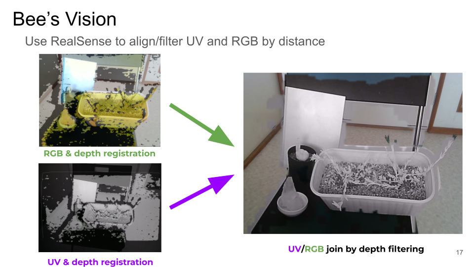

# Bee Vision
This is AR vision project that uses an stero camera along a monochrome infrared/uv sensor to enhance human vision into a Bee vision. 

For more info go to: https://docs.google.com/presentation/d/1815EMH4a4LPE7iLkHRDY29Lw1RvuR6CP9LhRx7gqRLs/edit#slide=id.p

# Hardware
By using depth information the image registration of the infrared or UV sensor is rectifed to the RGB camera perspective

First results

## Video of the last prototype running in real time with OpenCV/CUDA (20 fps - still to slow for HMD... ) 

## Video of the first prototype with a single camera/UV sensor

## Video of the first prototype with a single camera/Infrared sensor

